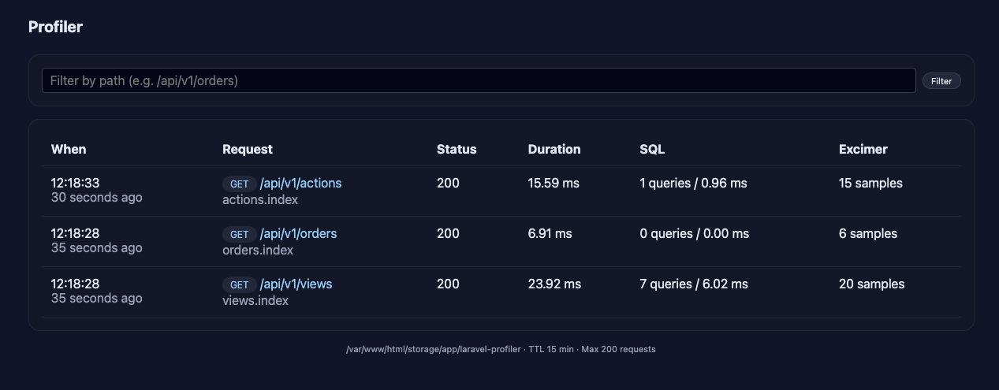
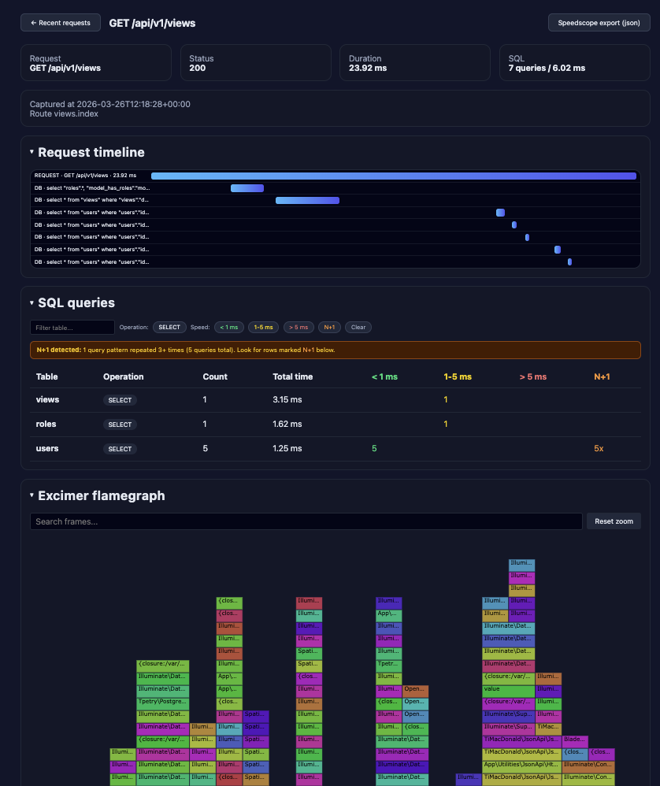

# Laravel Flamegraph Profiler

A local development request profiler for Laravel with temporary storage, SQL query analysis, N+1 detection, and [Excimer](https://www.mediawiki.org/wiki/Excimer) flamegraph support.

<p></p>
<p></p>

## Features

- **Request dashboard** — lists recent HTTP requests with method, path, status, duration, and query count
- **Request timeline** — waterfall view of every span (middleware, controller, DB queries) in a single request
- **SQL query analysis** — queries grouped by table and operation, color-coded by speed, with expandable detail rows
- **N+1 detection** — automatically flags query patterns that repeat 3+ times
- **Excimer flamegraph** — interactive d3-flame-graph powered by the Excimer PHP extension, with search and zoom
- **Speedscope export** — download profiling data as JSON compatible with [Speedscope](https://www.speedscope.app/)
- **Path filtering** — filter the request list by URL path
- **Auto-cleanup** — file-based storage with configurable TTL and max entry limits
- **Zero config** — auto-attaches to all `web` and `api` routes; restricted to local/development environments by default

## Requirements

- PHP 8.3+
- Laravel 12
- [Excimer PHP extension](https://www.mediawiki.org/wiki/Excimer) (optional, required for flamegraphs)

## Installation

```bash
composer require exabyssus/laravel-flamegraph-profiler --dev
```

The service provider is auto-discovered. No additional setup is needed.

## Usage

Start your Laravel app and visit:

```
http://your-app.test/profiler
```

Every `web` and `api` request is automatically profiled. Click any row to see the full request detail with timeline, SQL breakdown, and flamegraph.


## Configuration

Publish the config file to customize defaults:

```bash
php artisan vendor:publish --tag=laravel-profiler-config
```

All options can be set via environment variables:

| Variable | Default | Description |
|---|---|---|
| `LARAVEL_PROFILER_ENABLED` | `true` | Enable or disable profiling |
| `LARAVEL_PROFILER_ALLOWED_ENVIRONMENTS` | `local,development` | Comma-separated list of allowed environments |
| `LARAVEL_PROFILER_ROUTE_PREFIX` | `profiler` | URL prefix for the dashboard |
| `LARAVEL_PROFILER_STORAGE_PATH` | `storage/app/laravel-profiler` | Where profile data is stored |
| `LARAVEL_PROFILER_TTL_MINUTES` | `15` | How long profiles are kept |
| `LARAVEL_PROFILER_MAX_ENTRIES` | `200` | Maximum number of stored profiles |
| `LARAVEL_PROFILER_INDEX_LIMIT` | `50` | Number of profiles shown on the dashboard |
| `LARAVEL_PROFILER_EXCIMER_SAMPLE_PERIOD` | `0.001` | Excimer sampling interval in seconds |
| `LARAVEL_PROFILER_EXCIMER_MAX_DEPTH` | `250` | Maximum call stack depth for Excimer |

## License

MIT
